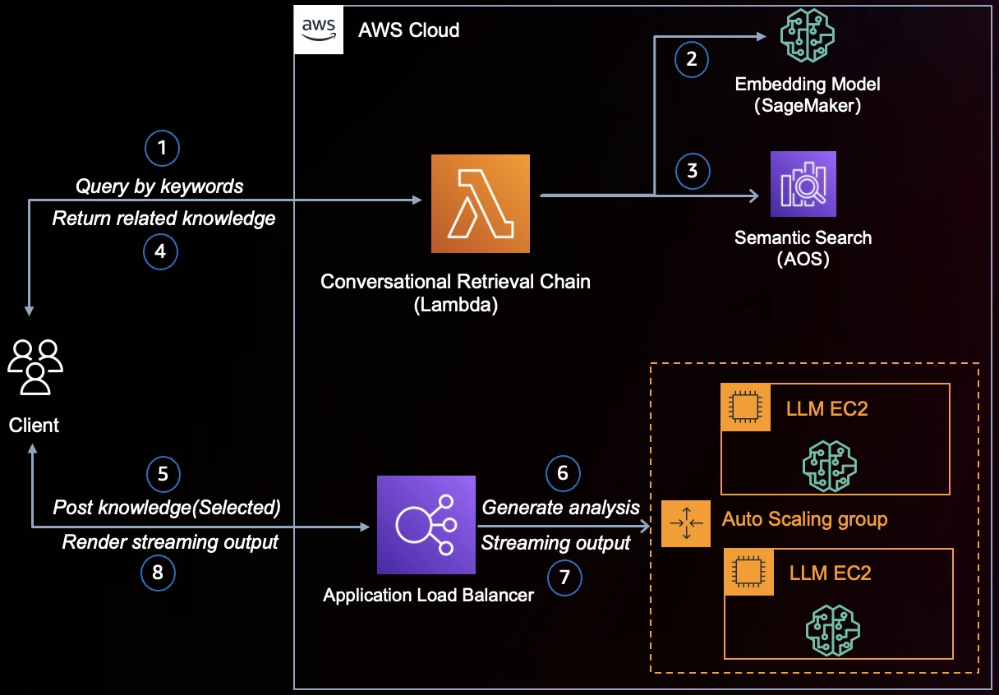

# RAG with Streaming LLM
This hands-on workshop, aimed at developers and solution builders, introduces how to leverage LLMs for RAG(Retrieval Augmented Generation).

In this solution,
* we bring kNN to search solutions of related problems by AWS Opensearch;
* Use one of LLM models to do analysis for all related content and rendering with streamed response from the LLM model.


## Overview

This solution illustrate how to do semantic search across AWS AOS and utilize a LLM model to generate analysis with the following steps,
1. Query by keywords from Client for the solutions relating what you ask
2. Generate Embedding for keywords with Embedding Model
3. Search useful knowledge by keyword Embedding across vector DB
4. Return domain-specific knowledge from Vector DB
5. Post selected or all related information to LLM backend
6. Generate problem analysis and solution suggestion by LLM
7. Start to stream out the generated text word by word
8. Render the output word by word

## Cost

You are responsible for the cost of the AWS services used while running this solution. 

## Prerequisites

### Operating System
You need to
* prepare an ec2 instance with x86_64 architecture(t3.xlarge is recommended) for the deployment
  * install cdk in this deployment machine and get your account bootstrapped, please refer to [Install the AWS CDK](https://docs.aws.amazon.com/cdk/v2/guide/getting_started.html#getting_started_install)
  * install docker in this deployment machine de and start the docker:: 
    ```shell
    $ sudo yum install docker
    $ sudo systemctl start docker
    ```
  * make sure Python3 is installed in this instance

### Third-party tools
#### Install Docker
In this step, you will install Docker. This is required for the next step to build a LLM docker Image and push it to Amazon ECR.
```shell
sudo yum install docker
sudo usermod -aG docker ${USER}
sudo service docker start
```

Verify that if you can run Docker commands without sudo.
```shell
sudo docker info
```

#### Install git
To install git, you will need to kick below command:
```shell
sudo yum install -y git
```

Git LFS (Large File Storage) is an open-source Git extension developed by GitHub. It is created to handle files that are large and cannot be managed easily by Git itself. 
We will need Git LFS to download LLM model, please refer to  [Install glf on AWS Ec2](https://stackoverflow.com/questions/71448559/git-large-file-storage-how-to-install-git-lfs-on-aws-ec2-linux-2-no-package)  to install git-lfs. Simply for most EC2 instance you can enter following commands in the notebook console, 
```shell
sudo amazon-linux-extras install epel -y 
sudo yum-config-manager —enable epel
sudo yum install git-lfs -y
sudo git lfs install
```

### [Insomnia](https://insomnia.rest/) (Optional)
You can post request with AWS IAM V4 Auth to test deployed API

### AWS account requirements

This deployment requires the following available in your AWS account

**Required resources:**
- AWS S3 bucket
- AWS AOS
- AWS SecretsManager
- AWS VPC
- AWS IAM role with specific permissions
- AWS SageMaker

Make sure your account can utility the above resources.

## Deploy the solution
### Download a LLM model
Please refer to [Downloading models Using Git](https://huggingface.co/docs/hub/models-downloading#using-git) and configure up your SSH user settings.
```shell
cd infrastructure/docker/
git clone git@hf.co:THUDM/chatglm2-6b
```
### Prepare python env
Before you deploy this solution, be sure you have right aws credentials configured.
Now you need to install deployment dependencies.
```shell
  $ cd infrastructure
  $ python3 -m venv .venv
  $ . venv/bin/activate
  $ pip install -r requirements.txt
```

Then you can deploy by cdk with the following commands:
```shell
  $ cdk deploy RAGSearchWithLLMInfraStack --require-approval never
  $ cdk deploy RAGSearchWithLLMSemanticSearchLambdaStack --require-approval never
  $ cdk deploy RAGSearchWithLLMFrontendStack --require-approval never
```

After each command is done, the command prompt reappears. You can go to the AWS CloudFormation console and see that all three stacks: `RAGSearchWithLLMInfraStack`, `RAGSearchWithLLMSemanticSearchLambdaStack` and `RAGSearchWithLLMFrontendStack`. 

## Ingest sample data
You need to ingest some data to play with this solution. We provide a simple list of question-answer pairs. You can ingest with SageMaker Notebook and upload whole `data` folder into this notebook instance. Please follow the instructions in `data/data_ingestion.ipynb` to feed data into AWS AOS.

## Test
After deployment and data ingestion, you can get an url of from `RAGSearchWithLLMFrontendStack` stack in output cdk.
```shell
Outputs:
RAGSearchWithLLMFrontendStack.RAGSearchWithLLMFrontendSmartSearchUrl*** = https://***.cloudfront.net

```

### Service limits  (if applicable)

The solution can handle QA pairs for summarization. You can extend it if you have other requirements.

## Cleanup
Please kick `cdk destroy --all` to clean up the whole environment in this path `infrastructure`.

## FAQ, known issues, additional considerations, and limitations
N/A

## Revisions
N/A

## Notices
During the launch of this reference architecture,
you will install software (and dependencies) on the Amazon EC2 instances launched
in your account via stack creation.
The software packages and/or sources you will install
will be from the Amazon Linux distribution and AWS Services, as well as from third party sites.
Here is the list of third party software, the source link,
and the license link for each software.
Please review and decide your comfort with installing these before continuing.

BSD License: https://opensource.org/licenses/bsd-license.php

Historical Permission Notice and Disclaimer (HPND): https://opensource.org/licenses/HPND

MIT License: https://github.com/tsenart/vegeta/blob/master/LICENSE

Apache Software License 2.0: https://www.apache.org/licenses/LICENSE-2.0

Mozilla Public License 2.0 (MPL 2.0): https://www.mozilla.org/en-US/MPL/2.0/

ISC License: https://opensource.org/licenses/ISC
